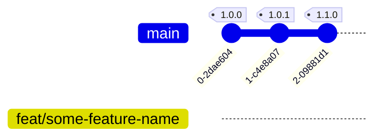

# Git & GitHub
For source control we use GitHub. All projects are repositories under [scrambledeggs](https://github.com/scrambledeggs).

## Workflow
- Prefer to adapt [Gitlab flow](https://about.gitlab.com/2014/09/29/gitlab-flow/)
- Use descriptive feature branch names and name them using [`kebab-case`](https://en.wikipedia.org/wiki/Letter_case#Special_case_styles)

## Versioning
- Prefer to use [semantic versioning](http://semver.org/) where applicable.

## Branching

### `main` / `master`

- The canonical version of the code for active development lives in
- The main working branch of the application. All releases should be merged to this branch
- Write protected and merging to `main`/`master` will require a [pull request](https://help.github.com/articles/about-pull-requests/).

### `feat/feature-name`

feat - short for feature - this branch will contain code for a new feature or functionality such as:
- new textbox
- new banner
- new web page or screen
- new login flow

### `chore/chore-name`

this branch contains code for code maintenance such as:
- refactoring code
- upgrading dependencies
- copy changes
- deleting unused files
- updating assets/images

### `fix/fix-name`
this branch contains fixes on bugs found in the application

### `hotfix/1.2.3`
this is a special `fix/` branch that needs immediate deployment on production due to the bug blocking major flows/behavior in the application

### Naming Conventions

- all `lowercase`
- use `-` as spaces
- add a prefix on the type of your branch (chore/fix/feat/hotfix)

## Branching Strategies

### Working on a Feature as a Sole Resource

create a branch from `main`

### Working on a Feature as a Team

1 - Create a branch from `main`

2 - Create a branch from the previously created feature as how many members you are 

## Commits and Pull Requests
- Commit often. Small commits are acceptable. General guideline is to commit when tests are passing.
- Make your commits contextual. Avoid commits that does other things that the commit was intended to.
- Commit messages that makes sense. Usually in this pattern: `"{action} {purpose|reason} {target}"`, order may vary.
  Avoid:
  > 1. Fix syntax error
  > 2. Refactoring
  > 3. Added update() method
  > 4. Added some CSS

  Prefer:
  > 1. Refactored header logic in HomeViewController
  > 2. Added CSS for Home Screen
  > 3. Fixes input validation bug for user#save
  > 4. Added version update checker feature

- If your commit references a Github Issue, make sure to mention it in your PR's description using [this format](https://help.github.com/articles/closing-issues-via-commit-messages/)
- Rebase on top of the latest `main`/`master` before merging.
  - If your branch is not synced/has conflicts with `main`/`master` (For example when a PR gets merged while you have a pending PR)
    1. On your local copy `git pull origin master`
    2. Fix conflicts
      - On things like `db/schema.rb` it's better to regenerate schema i.e. `bundle exec rails db:schema:dump`
