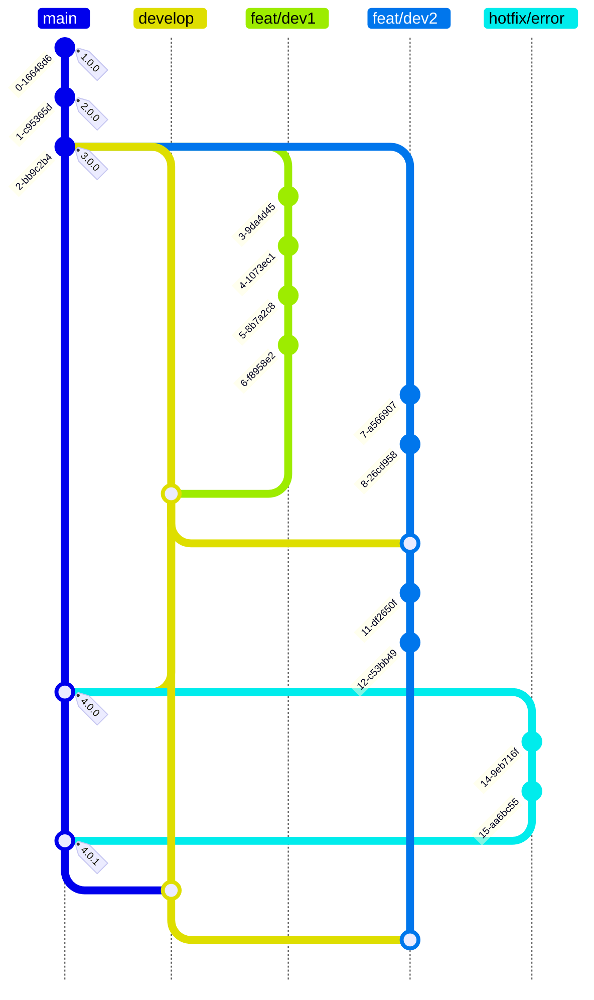
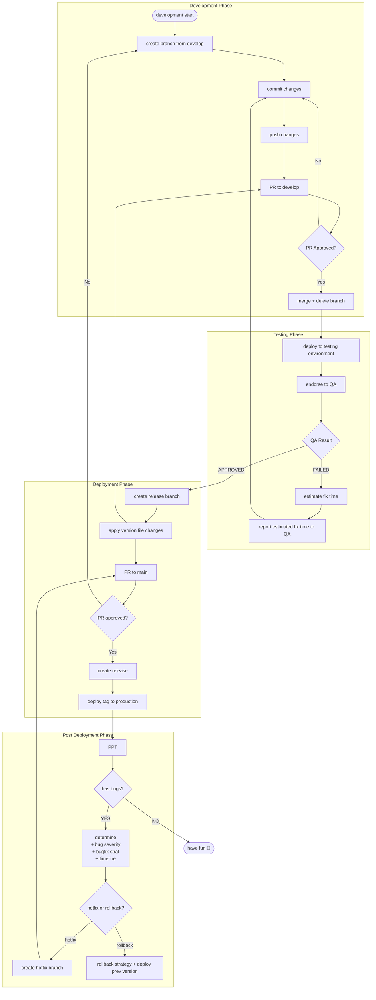

# PR Process

## Trunk based development diagram

## Workflow

### Development Phase
- create a new branch from `develop`
- commit changes
- make sure pull the latest `develop` branch
- push your branch to remote
- create a Pull Request - base branch: `develop`
- merge upon approvals and self confidence on your branch (Note: use merge commit)

### Testing Phase
- Make sure your branch is merged to `develop`
- Deploy `develop` to [testing environment]
- Endorse to QA with 7 characters commit hash
- Wait for QA results

### Bug fixing in Testing Phase

- Estimate time needed to address bugs
- Report estimated time to QA
- Go back to Development Phase step

### Pre-release

- Adjust version files in repository

Node: in `package.json` - `version` field

Go: in `template.yml` - `Metadata.SemanticVersion` field

Rails: `.version` file

- Commit and push changes
- Create PR for version change

#### Version Naming
Use semantic versioning system: https://semver.org/

### Deployment Phase

- create a release (in github)
- create tag
- always deploy tag created

## Branch Naming Guide

- All characters should be lowercase
- use `kebab-case` naming
- descriptive name but not too long
- Max characters: 15 (not counting prefix)

Use the following prefixes for branch names:

### `feat/`

for code that provide new features for the application

examples:  
- New endpoints
- New web pages/app screens
- New sections in the app frontend

### `fix/`

### `chore/`

### `feat/`

### `release/`

### `hotfix/`

### `test/`

For branches that you want to test but not necessarily want to merge it (maybe for poc)

## Code Reviewers

Note: All are required unless stated

### PR to `develop`

- All *present* members of vertical team
- 1 Horizontal lead - If template.yml/database structure changed (BE)
- 1 Horizontal lead - Site/Screen structure (FE)
- 1 representative from other verticals (ideally junior)

Note:
Liability of Vertical Lead + Sub lead/s if branch merged to `develop` caused errors

### PR to `main`

- Same as above
- CTO/Engineering Manager
- 2 Horizontal Leads - If CTO/Engineering Manager is not available
- Other Technical leads if No Horizontal leads available

Note:
Liability of Vertical Lead + Sub lead/s + Approvers if `main` branch is broken

### PR Time Period

- PRs should be resolved before the estimated Time commitment in ticket (ideally: the day before QA testing phase)

## PR Description

- change description
- breaking changes
- screenshots/videos (FE)
- route list for new pages/screens with short description
- related architecture diagrams/tables (BE)
- feature flag list/description updates
- environment variables list/description updates
- links to previous related and merged PRs
- related tickets

## Notes

- Responsibility of the Requester to follow-up Reviewers
